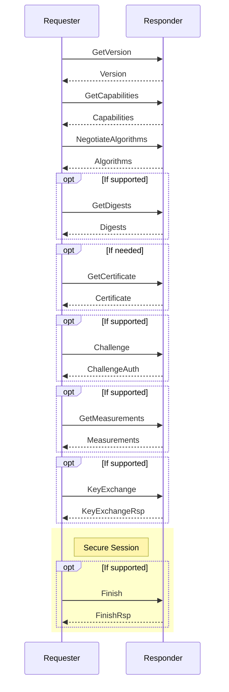
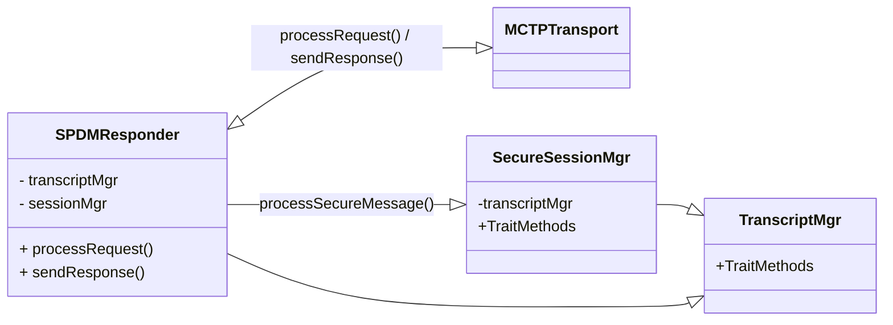

# SPDM
The Security Protocol and Data Model (SPDM) is a protocol designed to ensure secure communication between hardware components by focusing on mutual authentication and the establishment of secure channels over potentially insecure media. SPDM enables devices to verify each other's identities and configurations, leveraging X.509v3 certificates to ensure cryptographic security. Designed for interoperability, it can work across various transport and physical media, often utilizing the Management Component Transport Protocol (MCTP). This protocol is especially valuable in environments where secure hardware communication is crucial, such as data centers and enterprise systems.

## Specifications
| Specification                                 | Document Link                                                                             |
| --------------------------------------------- | ----------------------------------------------------------------------------------------- |
| Security Protocol and Data Model              | [DSP0274](https://www.dmtf.org/sites/default/files/standards/documents/DSP0274_1.3.2.pdf) |
| Secured Messages using SPDM                   | [DSP0277](https://www.dmtf.org/sites/default/files/standards/documents/DSP0277_1.2.0.pdf) |
| SPDM over MCTP Binding Specification          | [DSP0275](https://www.dmtf.org/sites/default/files/standards/documents/DSP0275_1.0.2.pdf) |
| Secured Messages using SPDM over MCTP Binding | [DSP0276](https://www.dmtf.org/sites/default/files/standards/documents/DSP0276_1.2.0.pdf) |

## SPDM Protocol Sequence


## Class Diagram



## SPDM Responder
The Responder is responsible for receiving and processing requests from the Requestor. It authenticates the Requestor's identity, attests its own state and configuration, and establishes a secure communication channel. The Responder uses cryptographic techniques, such as validating X.509v3 certificates, to ensure the integrity and confidentiality of the exchanged data.

### Responder supported messages
The SPDM Responder supports the following messages:

| Message            | Description                                                                     |
| ------------------ | ------------------------------------------------------------------------------- |
| `VERSION`          | Retrieves version information                                                   |
| `CAPABILITIES`     | Retrieves SPDM capabilities                                                     |
| `ALGORITHMS`       | Retrieves the negotiated algorithms                                             |
| `DIGESTS`          | Retrieves digest of the certificate chains                                      |
| `CERTIFICATE`      | Retrieves certificate chains                                                    |
| `MEASUREMENTS`     | Retrieves measurements of elements such as internal state                       |
| `KEY_EXCHANGE_RSP` | Retrieves the responder's public key information                                |
| `FINISH_RSP`       | Provide key confirmation, bind the identity of each party to the exchanged keys |
| `END_SESSION_ACK`  | End session acknowledgment                                                      |
| `ERROR`            | Error message                                                                   |


### Responder Interface
```Rust
pub struct SpdmResponder<T: MctpTransport, U: SpdmTranscriptManager, V: SpdmSecureSessionManager> {
    transport: &'a dyn T,
    transcript_manager: &'a dyn U,
    session_manager: &'a dyn V,
    cert_store: &'a SpdmCertStore,
}

impl<T: MctpTransport, U: SpdmTranscriptManager, V: SpdmSecureSessionManager> SpdmResponder<T, U, V> {
    pub fn new(transport: T, transcript_manager: U, session_manager: V, cert_store: &'a SpdmCertStore) -> Self {
        SpdmResponder {
            transport,
            transcript_manager,
            session_manager,
            cert_store,
        }
    }

    pub async fn handle_request(&mut self, request_info: u32) {
        // request_info: Bits[16:23] Message Type [SPDM | Secure SPDM]
    }
}

```

## Transcript Manager
The Transcript Manager is for managing the transcript and the transcript hash. The transcript is a sequential concatenation of prescribed full messages or message fields. The transcript hash is the cryptographic hash of this transcript, computed using the negotiated hash algorithm. This component ensures the integrity and authenticity of SPDM communications by managing these essential elements.

### Transcript Manager Interface
```Rust
pub trait SpdmTranscriptManager {
    /// Set the hash algorithm. The algorithm can be set only once.
    ///
    /// # Parameters
    /// - `hash_algo`: Hash algorithm to set.
    ///
    /// # Returns
    /// - `Result<(), SpdmError>`: Returns `Ok(())` if the hash algorithm was set, or an error code.
    fn set_hash_algo(&self, hash_algo: HashType) -> Result<(), SpdmError>;

    /// Set the SPDM negotiated version to be used for communication.
    ///
    /// # Parameters
    /// - `spdm_version`: SPDM negotiated version.
    fn set_spdm_version(&self, spdm_version: u8);

    /// Update the transcript with a message.
    ///
    /// # Parameters
    /// - `context_type`:        Transcript context to update.
    /// - `message`:             Message to add to the transcript.
    /// - `use_session_context`: Use session context to update an SPDM session transcript.
    /// - `session_idx`:         SPDM session index.
    ///
    /// # Returns
    /// - `Result<(), SpdmError>`:
    /// Returns `Ok(())` if the message was added to the transcript successfully, or an error code.
    async fn update(
        &self,
        context_type: SpdmTranscriptManagerContextType, // [VCA, M1M2, L1L2, TH]
        message: &[u8],
        use_session_context: bool,
        session_idx: u8,
    ) -> Result<(), SpdmError>;

    /// Get the hash based on the hash type. The hashing operation is finished if `finish_hash` is set
    /// to `true`. In that case, an additional call to update will start a new hashing operation.
    /// If `finish_hash` is set to `false`, the hash is not finalized and can be updated with additional
    /// calls to update.
    ///
    /// # Parameters
    /// - `context_type`:        Transcript context type to get the hash from.
    /// - `finish_hash`:         Flag to indicate to finish the hash.
    /// - `use_session_context`: Use session context to update an SPDM session transcript.
    /// - `session_idx`:         SPDM session index.
    /// - `hash`:                Buffer to copy the hash to.
    ///
    /// # Returns
    /// - `Result<Vec<u8>, SpdmError>`: Returns the hash if the operation was successful, or an error code.
    fn get_hash(
        &self,
        context_type: SpdmTranscriptManagerContextType, // [VCA, M1M2, L1L2, TH]
        finish_hash: bool,
        use_session_context: bool,
        session_idx: u8,
        hash: &mut [u8]
    ) -> Result<(), SpdmError>;

    /// Reset a transcript context.
    ///
    /// # Parameters
    /// - `context_type`:        Transcript context to reset.
    /// - `use_session_context`: Use session context to update an SPDM session transcript.
    /// - `session_idx`:         SPDM session index.
    fn reset_transcript(
        &self,
        context_type: SpdmTranscriptManagerContextType, // [VCA, M1M2, L1L2, TH]
        use_session_context: bool,
        session_idx: u8,
    );
}
```
## SPDM Certificate Store
The `SpdmCertStore` manages certificate chains for all provisioned slots in the SPDM Certificate chain format(see `Table33 - Certificate chain format` in [DSP0274](https://www.dmtf.org/sites/default/files/standards/documents/DSP0274_1.3.2.pdf)). 

The `SpdmCertStore` caches the certificate chain format information for each slot, including the length of the certificate chain format, the size of the hash algorithm used, and the hash of the root certificate in the certificate chain. This information is refreshed when a `GET_DIGESTS` command is received and is used to serve data in subsequent commands (e.g., `GET_CERTIFICATE`, `CHALLENGE`).

<br>
Each provisioned certificate slot corresponds to a `CertChain` instance, which handles the ASN.1 DER-encoded X.509 v3 certificate chain specific to that slot.
The retrieval of a certificate chain for a given slot is platform-dependent and implemented via the `CertChain` trait.

### Certificate Manager Interface
```Rust
pub const SPDM_MAX_CERT_SLOTS: usize = 1;
pub const SPDM_MAX_CERT_CHAIN_PORTION_LEN: usize = 512;

// SPDM Supported Slot Mask
pub type SupportedSlotMask = u8;

// SPDM Provisioned Slot Mask 
pub type ProvisionedSlotMask = u8;

///! SPDM certificate store for managing the certificate chain for SPDM protocol.
///! The certificate chain managed by the `SpdmCertStore` is in SPDM Cert chain format.
///! (See `Table 33 - Certificate Chain` Format in [DSP0274](https://www.dmtf.org/sites/default/files/standards/documents/DSP0274_1.3.2.pdf) specification)
pub struct SpdmCertStore<'a> {
    /// Supported slot mask indicates the slots that are supported by the SPDM responder.
    pub(crate) supported_slot_mask: SupportedSlotMask,
    /// Provisioned slot mask indicates the slots that are provisioned with certificate chains.
    pub(crate) provisioned_slot_mask: ProvisionedSlotMask,
    /// Certificate chain for each slot. The certificate chain is in ASN.1 DER-encoded X.509 v3 format.
    pub(crate) cert_chain: [Option<&'a mut dyn CertChain>; SPDM_MAX_CERT_SLOTS],
    /// Certificate chain state for each slot to store the recently computed cert chain format information.
    pub(crate) cert_chain_state: [Option<SpdmCertChainState>; SPDM_MAX_CERT_SLOTS],
}

impl<'a> SpdmCertStore<'a> {
    /// Create a new `SpdmCertStore` instance.
    ///
    /// # Arguments
    /// * `supported_slot_mask` - The supported slot mask.
    /// * `provisioned_slot_mask` - The provisioned slot mask.
    pub fn new(
        supported_slot_mask: u8,
        provisioned_slot_mask: u8,
        cert_chain: [Option<&'a mut dyn CertChain>; SPDM_MAX_CERT_SLOTS],
    ) -> CertStoreResult<Self>;

    /// Reset the certificate chain state for a given slot.
    /// This is done before handling the `DIGESTS` response to ensure the state is fresh.
    /// 
    /// # Arguments
    /// * `slot_id` - The ID of the slot to reset.
    /// 
    /// # Returns
    /// * `CertStoreResult<()>` - Result indicating success or failure.
    pub fn reset_cert_chain_state(&mut self, slot_id: u8) -> CertStoreResult<()>;

    /// Get the certificate slot mask.
    /// 
    /// # Returns
    /// * `(SupportedSlotMask, ProvisionedSlotMask)` - Tuple containing the supported and provisioned slot masks.
    pub fn cert_slot_mask(&self) -> (SupportedSlotMask, ProvisionedSlotMask);
        pub async fn cert_chain_hash(
        &mut self,
        slot_id: u8,
        hash_algo_sel: BaseHashAlgoType,
        digest: &mut [u8],
    ) -> CertStoreResult<usize>;

    /// Get the remaining length of the certificate chain in SPDM cert chain format from the given offset.
    /// This is needed to fill `RemainderLength` field in the `CERTIFICATE` response.
    /// 
    /// # Arguments
    /// * `hash_algo_sel` - The hash algorithm to use for the root certificate hash.
    /// * `slot_id` - The ID of the slot to get the length for.
    /// * `offset` - The offset in bytes from the start of the certificate chain.
    /// 
    /// # Returns
    /// * `CertStoreResult<u16>` - Result containing the length of the SPDM certificate chain or an error.
    pub async fn remainder_cert_chain_len(
        &mut self,
        hash_algo_sel: BaseHashAlgoType,
        slot_id: u8,
        offset: u16,
    ) -> CertStoreResult<u16>;
    
    /// Read the certificate chain in SPDM cert chain format from the given offset in portion.
    /// 
    /// # Arguments
    /// * `hash_algo_sel` - The hash algorithm to use for the root certificate hash.
    /// * `slot_id` - The ID of the slot to read the certificate chain from.
    /// * `offset` - The offset in bytes from the start of the certificate chain.
    /// * `cert_portion` - The buffer to store the portion of the certificate chain.
    /// 
    /// # Returns
    /// * `CertStoreResult<usize>` - Result containing the number of bytes read or an error.
    /// If the certificate portion size is smaller than the buffer size, the remaining bytes in the buffer will be filled with 0,
    /// indicating the end of the SPDM certificate chain.
    pub async fn read_cert_chain(
        &mut self,
        hash_algo_sel: BaseHashAlgoType,
        slot_id: u8,
        offset: usize,
        cert_portion: &mut [u8],
    ) -> CertStoreResult<usize>;
}

///! `SpdmCertChainState` is used to store the recently computed cert chain format information.
///! This information is refreshed when GET_DIGESTS command is received and is used to 
/// ! serve data in subsequent commands (e.g., GET_CERTIFICATE, CHALLENGE)
struct SpdmCertChainState {
    /// The length of the certificate chain format in bytes.
    pub(crate) cert_chain_format_len: u16,
    /// The size of the hash algorithm used for the certificate chain.
    pub(crate) hash_size: usize,
    /// The hash of the root certificate in the certificate chain.
    pub(crate) root_cert_hash: [u8; MAX_HASH_SIZE],
    /// The hash of the SPDM certificate chain format.
    pub(crate) cert_chain_format_hash: [u8; MAX_HASH_SIZE],
}

///! `CertChain` trait is responsible for managing SPDM certificate chain for a provisioned slot.
///! Each provisioned slot corresponds to an instance of the `CertChain`, which handles
///! the ASN.1 DER-encoded X.509 v3 certificate chain for that slot.
#[async_trait]
pub trait CertChain {
    /// Get the digest of the root certificate in the certificate chain.
    ///
    /// # Arguments
    /// * `hash_algo` - The hash algorithm to use for the digest.
    /// * `root_hash` - The buffer to store the digest of the root certificate.
    ///
    /// # Returns
    /// * `Ok(usize)` - The number of bytes written to the buffer or an error.
    async fn root_cert_hash<'a>(
        &mut self,
        hash_algo: BaseHashAlgoType,
        root_hash: &'a mut [u8],
    ) -> CertChainResult<usize>;

    /// Get the length of the certificate chain.
    ///
    /// # Returns
    /// * `Ok(usize)` - The length of the certificate chain in bytes or an error.
    async fn cert_chain_length(&mut self) -> CertChainResult<usize>;

    /// Read the certificate chain in portion. The certificate chain is in ASN.1 DER-encoded X.509 v3 format.
    ///
    /// # Arguments
    /// * `offset` - The offset in bytes from the start of the cert chain.
    /// * `cert_portion` - The buffer to store the portion of cert chain.
    ///
    /// # Returns
    /// * `Ok(usize)` - The number of bytes written to the buffer or an error.
    /// If the cert portion size is smaller than the buffer size, the remaining bytes in the buffer will be filled with 0,
    /// indicating the end of the cert chain.
    async fn read_cert_chain<'a>(
        &mut self,
        offset: usize,
        cert_portion: &'a mut [u8],
    ) -> CertChainResult<usize>;

    /// Get the KeyPairID associated with the certificate chain if SPDM responder supports
    /// multiple assymmetric keys in connection.
    ///
    /// # Returns
    /// * `Option<KeyPairID>` - The KeyPairID associated with the certificate chain or None if not supported or not found.
    fn key_pair_id(&mut self) -> Option<KeyPairID>;

    /// Get CertificateInfo associated with the certificate chain if SPDM responder supports
    /// multiple assymmetric keys in connection.
    ///
    /// # Returns
    /// * `Option<CertificateInfo>` - The CertificateInfo associated with the certificate chain or None if not supported or not found.
    fn cert_info(&mut self) -> Option<CertificateInfo>;

    /// Get the KeyUsageMask associated with the certificate chain if SPDM responder supports
    /// multiple assymmetric keys in connection.
    ///
    /// # Returns
    /// * `Option<KeyUsageMask>` - The KeyUsageMask associated with the certificate chain or None if not supported or not found.
    fn key_usage_mask(&mut self) -> Option<KeyUsageMask>;
}

// KeypairID associated with the certificate chain (for SPDM version >= 1.3)
pub type KeyPairID = u8; 

// CertificateInfo fields associated with the certificate chain (for SPDM version >= 1.3)
bitfield! {
#[derive(FromBytes, IntoBytes, Default, Clone)]
#[repr(C, packed)]
pub struct CertificateInfo(u8);
impl Debug;
u8;
pub cert_model, set_cert_model: 0,2;
reserved, _: 3,7;
}

// KeyUsageMask fields associated with certificate chain (for SPDM version >= 1.3)
bitfield! {
#[derive(FromBytes, IntoBytes, Default, Clone)]
#[repr(C, packed)]
pub struct KeyUsageMask(u16);
impl Debug;
u8;
pub key_exch_usage, set_key_exch_usage: 0,0;
pub challenge_usage, set_challenge_usage: 1,1;
pub measurement_usage, set_measurement_usage: 2,2;
pub endpoint_info_usage, set_endpoint_info_usage: 3,3;
reserved, _: 13,4;
pub standards_key_usage, set_standards_key_usage: 15,14;
pub vendor_key_usage, set_vendor_key_usage: 15,15;
}


```

## SPDM Secure Session Manager
The SPDM Secure Session Manager is responsible for managing secure sessions within the SPDM protocol framework. It provides mechanisms to create, release, and retrieve secure sessions. The manager can set and query the state of a session, ensuring secure communication between devices. It generates necessary cryptographic keys, including shared secrets, handshake keys, and data keys, through asynchronous methods. Additionally, it verifies the integrity and optionally decrypts secure messages, and encodes messages with appropriate security measures. The manager also tracks session validity and can reset session states and identifiers as needed, ensuring robust and secure session management.

### Secure Session Manager Interface
```Rust
pub trait SpdmSecureSessionManager {
    /// Create a new SPDM secure session.
    ///
    /// # Parameters
    /// - `session_id`:      Session Id for the session.
    /// - `is_requester`:    True if the session is for the requester, false otherwise.
    /// - `connection_info`: SPDM connection info.
    ///
    /// # Returns
    /// - `Option<&SpdmSecureSession>`:
    ///    A pointer to the created SPDM secure session or `None` if the session could not be created.
    fn create_session(
        &self,
        session_id: u32,
        is_requester: bool,
        connection_info: &SpdmConnectionInfo,
    ) -> Result<&SpdmSecureSession, SpdmError>;


    /// Release an SPDM secure session.
    ///
    /// # Parameters
    /// - `session_id`: Session Id for the session.
    fn release_session(&self, session_id: u32);

    /// Get an SPDM secure session.
    ///
    /// # Parameters
    /// - `session_id`: Session Id for the session.
    ///
    /// # Returns
    /// - `Option<&SpdmSecureSession>`: A pointer to the SPDM secure session or `None` if the session does not exist.
    fn get_session(& self, session_id: u32) -> Option<& SpdmSecureSession>;

    /// Set the session state for an SPDM secure session.
    ///
    /// # Parameters
    /// - `session_id`:    Session Id for the session.
    /// - `session_state`: Session state to set.
    fn set_session_state(&self, session_id: u32, session_state: SpdmSecureSessionState);

    /// Reset the Session Manager.
    fn reset(&self);

    /// Generate the shared secret from peer and local public keys.
    ///
    /// # Parameters
    /// - `session`:            SPDM session info.
    /// - `peer_pub_key_point`: Peer public key in point format.
    /// - `local_public_key`: Generated local public key in point format on return.
    ///
    /// # Returns
    /// - `Result<(), SpdmError>`:
    ///    Returns the local public key in point format if the shared secret is generated successfully, or an error code.
    fn generate_shared_secret(
        &self,
        session: &SpdmSecureSession,
        peer_pub_key_point: &EccPointPublicKey,
        local_public_key: &mut [u8]
    ) -> Result<(), SpdmError>;

    /// Generate handshake keys for an SPDM secure session.
    ///
    /// # Parameters
    /// - `session`: Secure Session.
    ///
    /// # Returns
    /// - `Result<(), SpdmError>`: Returns `Ok(())` if the handshake keys are generated successfully, or an error code.
    async fn generate_session_handshake_keys(&self, session: &mut SpdmSecureSession) -> Result<(), SpdmError>;

    /// Generate data keys for an SPDM secure session.
    ///
    /// # Parameters
    /// - `session`: SPDM Secure Session.
    ///
    /// # Returns
    /// - `Result<(), SpdmError>`: Returns `Ok(())` if the data keys are generated successfully, or an error code.
    async fn generate_session_data_keys(&self, session: &mut SpdmSecureSession) -> Result<(), SpdmError>;

    /// Query if the last session is active.
    ///
    /// # Returns
    /// - `bool`: True if the last session is active, false otherwise.
    fn is_last_session_id_valid(&self) -> bool;

    /// Get the last session id.
    ///
    /// # Returns
    /// - `u32`: Last session id.
    fn get_last_session_id(&self) -> u32;

    /// Reset the last session id validity.
    fn reset_last_session_id_validity(&self);

    /// Decode a secure message. This includes MAC verification and optionally decryption.
    ///
    /// # Parameters
    /// - `request`: SPDM request message to be decoded.
    ///
    /// # Returns
    /// - `Result<(), SpdmError>`: Returns `Ok(())` if the secure message is decoded successfully, or an error code.
    async fn decode_secure_message(&self, request: &mut [u8]) -> Result<(), SpdmError>;

    /// Encode a secure message. This includes MAC generation and optionally encryption.
    ///
    /// # Parameters
    /// - `response`: SPDM response message to be encoded.
    ///
    /// # Returns
    /// - `Result<(), SpdmError>`: Returns `Ok(())` if the secure message is encoded successfully, or an error code.
    async fn encode_secure_message(&self, response: &mut [u8]) -> Result<(), SpdmError>;
}
```