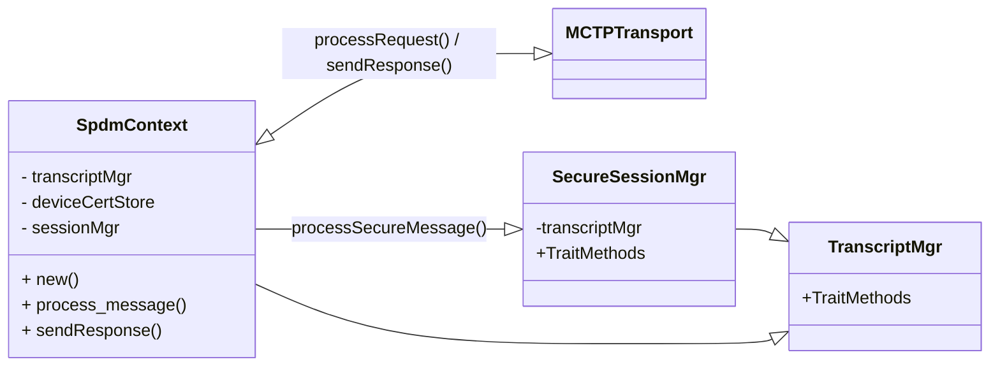
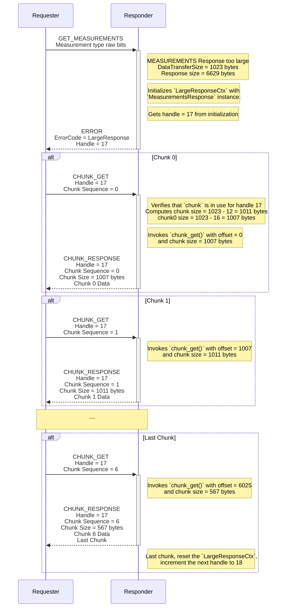

# SPDM
The Security Protocol and Data Model (SPDM) is a protocol designed to ensure secure communication between hardware components by focusing on mutual authentication and the establishment of secure channels over potentially insecure media. SPDM enables devices to verify each other's identities and configurations, leveraging X.509v3 certificates to ensure cryptographic security. Designed for interoperability, it can work across various transport and physical media, often utilizing the Management Component Transport Protocol (MCTP). This protocol is especially valuable in environments where secure hardware communication is crucial, such as data centers and enterprise systems.

## Specifications
| Specification                                 | Document Link                                                                             |
| --------------------------------------------- | ----------------------------------------------------------------------------------------- |
| Security Protocol and Data Model              | [DSP0274](https://www.dmtf.org/sites/default/files/standards/documents/DSP0274_1.3.2.pdf) |
| Secured Messages using SPDM                   | [DSP0277](https://www.dmtf.org/sites/default/files/standards/documents/DSP0277_1.2.0.pdf) |
| SPDM over MCTP Binding Specification          | [DSP0275](https://www.dmtf.org/sites/default/files/standards/documents/DSP0275_1.0.2.pdf) |
| Secured Messages using SPDM over MCTP Binding | [DSP0276](https://www.dmtf.org/sites/default/files/standards/documents/DSP0276_1.2.0.pdf) |

## SPDM Protocol Sequence


## Class Diagram



## SPDM Responder
The Responder is responsible for receiving and processing requests from the Requestor. It authenticates the Requestor's identity, attests its own state and configuration, and establishes a secure communication channel. The Responder uses cryptographic techniques, such as validating X.509v3 certificates, to ensure the integrity and confidentiality of the exchanged data.

### Responder supported messages
The SPDM Responder supports the following messages:

| Message            | Description                                                                     |
| ------------------ | ------------------------------------------------------------------------------- |
| `VERSION`          | Retrieves version information                                                   |
| `CAPABILITIES`     | Retrieves SPDM capabilities                                                     |
| `ALGORITHMS`       | Retrieves the negotiated algorithms                                             |
| `DIGESTS`          | Retrieves digest of the certificate chains                                      |
| `CERTIFICATE`      | Retrieves certificate chains                                                    |
| `MEASUREMENTS`     | Retrieves measurements of elements such as internal state                       |
| `KEY_EXCHANGE_RSP` | Retrieves the responder's public key information                                |
| `FINISH_RSP`       | Provide key confirmation, bind the identity of each party to the exchanged keys |
| `END_SESSION_ACK`  | End session acknowledgment                                                      |
| `ERROR`            | Error message                                                                   |


### Responder Interface
```Rust
pub struct SpdmResponder<T: SpdmTransport, C: SpdmCertStore> {
    transport: &'a dyn T,
    transcript_manager: TranscriptManager,
    session_manager: SpdmSecureSessionManager,
    cert_store: &'a dyn C,
    measurements: SpdmMeasurements,
}

impl<T: SpdmTransport, C: SpdmCertStore> SpdmResponder<T, C> {
    pub fn new(transport: T, cert_store: &'a dyn C) -> Self {
        SpdmResponder {
            transport,
            transcript_manager : TranscriptManager::new(),
            session_manager : SpdmSecureSessionManager::new(),
            cert_store,
            measurements: SpdmMeasurements::default(),
        }
    }

    pub async fn process_message(&mut self, msg_buf: &mut MessageBuf<'a>) -> SpdmResult<()> {
        // receive a request from the transport and process
    }
}

```
## Transcript Manager
The Transcript Manager is responsible for handling the transcript and its associated hash. The transcript represents a sequential concatenation of specific full SPDM messages or message fields, while the transcript hash is a cryptographic hash of this transcript. The transcript hash is computed using the negotiated hash algorithm (SHA384).

In the SPDM responder library, the transcript and transcript hash for SPDM messages are managed internally. The library leverages the Caliptra mailbox crypto API for SHA384 to compute the transcript hash.

### Transcript Manager Interface
```Rust
// VCA buffer to store the concatenated VCA messages
struct VcaBuffer {
    data: [u8; Self::SPDM_MAX_BUFFER_SIZE],
    size: usize,
}

pub enum TranscriptContext {
    Vca,
    M1,
    L1,
}

/// Transcript management for the SPDM responder.
pub(crate) struct TranscriptManager {
    spdm_version: SpdmVersion,
    // Buffer for storing `VCA`
    // VCA or A = Concatenate (GET_VERSION, VERSION, GET_CAPABILITIES, CAPABILITIES, NEGOTIATE_ALGORITHMS, ALGORITHMS)
    vca_buf: VcaBuffer,
    // Hash context for `M1`
    // M1 = Concatenate(A, B, C)
    // where
    // B = Concatenate (GET_DIGESTS, DIGESTS, GET_CERTIFICATE, CERTIFICATE)
    // C = Concatenate (CHALLENGE, CHALLENGE_AUTH\signature)
    hash_ctx_m1: Option<HashContext>,
    // Hash Context for `L1`
    // L1 = Concatenate(A, M) if SPDM_VERSION >= 1.2 or L1 = Concatenate(M) if SPDM_VERSION < 1.2
    // where
    // M = Concatenate (GET_MEASUREMENTS, MEASUREMENTS\signature)
    hash_ctx_l1: Option<HashContext>,
}

pub struct TranscriptManager {
    /// Create a new instance of the `TranscriptManager`.
    pub fn new() -> Self;

    /// Set the SPDM version selected by the SPDM responder.
    ///
    /// # Arguments
    /// * `spdm_version` - The SPDM version to set.
    pub fn set_spdm_version(&mut self, spdm_version: SpdmVersion);

    /// Append data to a transcript context.
    ///
    /// # Arguments
    /// * `context` - The context to append data to.
    /// * `data` - The data to append.
    ///
    /// # Returns
    /// * `TranscriptResult<()>` - Result indicating success or failure.
    pub async fn append(
        &mut self,
        context: TranscriptContext,
        data: &[u8],
    ) -> TranscriptResult<()>;

    /// Finalize the hash for a given context.
    ///
    /// # Arguments
    /// * `context` - The context to finalize the hash for.
    /// * `hash` - The buffer to store the resulting hash.
    ///
    /// # Returns
    /// * `TranscriptResult<()>` - Result indicating success or failure.
    pub async fn hash(
        &mut self,
        context: TranscriptContext,
        hash: &mut [u8; SHA384_HASH_SIZE],
    ) -> TranscriptResult<()>;

    /// Reset all transcript contexts.
    ///
    /// # Arguments
    /// * `context` - The context to reset. If `None`, all contexts are reset.
    pub fn reset(&mut self);

    /// Reset a transcript context.
    ///
    /// # Arguments
    /// * `context` - The context to reset. If `None`, all contexts are reset.
    pub fn reset_context(&mut self, context: TranscriptContext);
}
```

## SPDM Certificate Store
The `SpdmCertStore` trait provides the interfaces to retrieve and manage the certificate chain for all available slots in the device.

### Certificate Manager Interface
```Rust

pub const SHA384_HASH_SIZE: usize = 48;
pub const ECC_P384_SIGNATURE_SIZE: usize = 96;

// Type of Asymmetric Algorithm selected by the SPDM responder
// Currently only ECC P384 is supported.
// This can be extended to support PQC algorithms in future.
pub enum AsymAlgo {
    EccP384,
}

#[async_trait]
pub trait SpdmCertStore {
    /// Get supported certificate slot count
    /// The supported slots are consecutive from 0 to slot_count - 1.
    ///
    /// # Returns
    /// * `u8` - The number of supported certificate slots.
    fn slot_count(&self) -> u8;

    /// Check if the slot is provisioned.
    ///
    /// # Arguments
    /// * `slot_id` - The slot ID of the certificate chain.
    ///
    /// # Returns
    /// * `bool` - True if the slot is provisioned, false otherwise.
    fn is_provisioned(&self, slot_id: u8) -> bool;

    /// Get the length of the certificate chain in bytes.
    /// The certificate chain is in ASN.1 DER-encoded X.509 v3 format.
    /// The type of the certificate chain is indicated by the asym_algo parameter.
    ///
    /// # Arguments
    /// * `slot_id` - The slot ID of the certificate chain.
    /// * `asym_algo` - The asymmetric algorithm to indicate the type of certificate chain.
    ///
    /// # Returns
    /// * `usize` - The length of the certificate chain in bytes or error.
    async fn cert_chain_len(&mut self, asym_algo: AsymAlgo, slot_id: u8) -> CertStoreResult<usize>;

    /// Get the certificate chain in portion. The certificate chain is in ASN.1 DER-encoded X.509 v3 format.
    /// The type of the certificate chain is indicated by the asym_algo parameter.
    ///
    /// # Arguments
    /// * `slot_id` - The slot ID of the certificate chain.
    /// * `asym_algo` - The asymmetric algorithm to indicate the type of Certificate chain.
    /// * `offset` - The offset in bytes to start reading from.
    /// * `cert_portion` - The buffer to read the certificate chain into.
    ///
    /// # Returns
    /// * `usize` - The number of bytes read or error.
    /// If the cert portion size is smaller than the buffer size, the remaining bytes in the buffer will be filled with 0,
    /// indicating the end of the cert chain.
    async fn get_cert_chain<'a>(
        &mut self,
        slot_id: u8,
        asym_algo: AsymAlgo,
        offset: usize,
        cert_portion: &'a mut [u8],
    ) -> CertStoreResult<usize>;

    /// Get the hash of the root certificate in the certificate chain.
    /// The hash algorithm is always SHA-384. The type of the certificate chain is indicated by the asym_algo parameter.
    ///
    /// # Arguments
    /// * `slot_id` - The slot ID of the certificate chain.
    /// * `asym_algo` - The asymmetric algorithm to indicate the type of Certificate chain.
    /// * `cert_hash` - The buffer to store the hash of the root certificate.
    ///
    /// # Returns
    /// * `()` - Ok if successful, error otherwise.
    async fn root_cert_hash<'a>(
        &mut self,
        slot_id: u8,
        asym_algo: AsymAlgo,
        cert_hash: &'a mut [u8; SHA384_HASH_SIZE],
    ) -> CertStoreResult<()>;

    /// Sign hash with leaf certificate key
    ///
    /// # Arguments
    /// * `slot_id` - The slot ID of the certificate chain.
    /// * `hash` - The hash to sign.
    /// * `signature` - The output buffer to store the ECC384 signature.
    ///
    /// # Returns
    /// * `()` - Ok if successful, error otherwise.
    async fn sign_hash<'a>(
        &self,
        slot_id: u8,
        hash: &'a [u8; SHA384_HASH_SIZE],
        signature: &'a mut [u8; ECC_P384_SIGNATURE_SIZE],
    ) -> CertStoreResult<()>;

    /// Get the KeyPairID associated with the certificate chain if SPDM responder supports
    /// multiple assymmetric keys in connection.
    ///
    /// # Arguments
    /// * `slot_id` - The slot ID of the certificate chain.
    ///
    /// # Returns
    /// * u8 - The KeyPairID associated with the certificate chain or None if not supported or not found.
    fn key_pair_id(&self, slot_id: u8) -> Option<u8>;

    /// Retrieve the `CertificateInfo` associated with the certificate chain for the given slot.
    /// The `CertificateInfo` structure specifies the certificate model (such as DeviceID, Alias, or General),
    /// and includes reserved bits for future extensions.
    ///
    /// # Arguments
    /// * `slot_id` - The slot ID of the certificate chain.
    ///
    /// # Returns
    /// * `CertificateInfo` - The CertificateInfo associated with the certificate chain or None if not supported or not found.
    fn cert_info(&self, slot_id: u8) -> Option<CertificateInfo>;

    /// Get the KeyUsageMask associated with the certificate chain if SPDM responder supports
    /// multiple asymmetric keys in connection.
    ///
    /// # Arguments
    /// * `slot_id` - The slot ID of the certificate chain.
    ///
    /// # Returns
    /// * `KeyUsageMask` - The KeyUsageMask associated with the certificate chain or None if not supported or not found.
    fn key_usage_mask(&self, slot_id: u8) -> Option<KeyUsageMask>;
}


// CertificateInfo fields associated with the certificate chain (for SPDM version >= 1.3)
bitfield! {
#[derive(FromBytes, IntoBytes, Default, Clone)]
#[repr(C, packed)]
pub struct CertificateInfo(u8);
impl Debug;
u8;
pub cert_model, set_cert_model: 0,2;
reserved, _: 3,7;
}

// KeyUsageMask fields associated with certificate chain (for SPDM version >= 1.3)
bitfield! {
#[derive(FromBytes, IntoBytes, Default, Clone)]
#[repr(C, packed)]
pub struct KeyUsageMask(u16);
impl Debug;
u8;
pub key_exch_usage, set_key_exch_usage: 0,0;
pub challenge_usage, set_challenge_usage: 1,1;
pub measurement_usage, set_measurement_usage: 2,2;
pub endpoint_info_usage, set_endpoint_info_usage: 3,3;
reserved, _: 13,4;
pub standards_key_usage, set_standards_key_usage: 15,14;
pub vendor_key_usage, set_vendor_key_usage: 15,15;
}


```


## SPDM Measurements
Caliptra device measurements can be reported in either a `structured` format (TBD) or a `freeform measurement` manifest format. Currently the default implementation is set to  `freeform measurement` manifest format. 

The `SpdmMeasurements` enum encapsulates these implementations and provides a generic interface for retrieving device measurements in the DMTF measurement specification format. The interface is defined to be conducive to the SPDM large response message transfer mechanism (using `CHUNK_GET` and `CHUNK_RESPONSE` messages). 

### Measurements Interface

```Rust
pub(crate) enum SpdmMeasurements {
    FreeformManifest(FreeformManifest),
    StructuredManifest(StructuredManifest),
}

impl Default for SpdmMeasurements {
    fn default() -> Self {
        SpdmMeasurements::FreeformManifest(FreeformManifest::default())
    }
}

impl SpdmMeasurements {
    /// Returns the total number of measurement blocks.
    ///
    /// # Returns
    /// The total number of measurement blocks.
    pub(crate) fn total_measurement_count(&self) -> usize;

    /// Returns the measurement block size for the given index.
    /// valid index is 1 to 0xFF.
    /// when index is 0xFF, it returns the size of all measurement blocks.
    ///
    /// # Arguments
    /// * `index` - The index of the measurement block.
    /// * `raw_bit_stream` - If true, returns the raw bit stream.
    ///
    /// # Returns
    /// The size of the measurement block.
    pub(crate) async fn measurement_block_size(
        &mut self,
        index: u8,
        raw_bit_stream: bool,
    ) -> usize;

    /// Returns all measurement blocks.
    ///
    /// # Arguments
    /// * `raw_bit_stream` - If true, returns the raw bit stream.
    /// * `offset` - The offset to start reading from.
    pub(crate) async fn measurement_record(
        &mut self,
        raw_bit_stream: bool,
        offset: usize,
        measurement_chunk: &mut [u8],
    ) -> MeasurementsResult<()>;

    /// Returns the measurement block for the given index.
    ///
    /// # Arguments
    /// * `index` - The index of the measurement block. Should be between 1 and 0xFE.
    /// * `raw_bit_stream` - If true, returns the raw bit stream.
    /// * `offset` - The offset to start reading from.
    /// * `measurement_chunk` - The buffer to store the measurement block.
    ///
    /// # Returns
    /// A result indicating success or failure.
    pub(crate) async fn measurement_block(
        &mut self,
        index: u8,
        raw_bit_stream: bool,
        offset: usize,
        measurement_chunk: &mut [u8],
    ) -> MeasurementsResult<()>;

    /// Returns the measurement summary hash.
    /// This is a hash of all the measurement blocks
    ///
    /// # Arguments
    /// * `hash` - The buffer to store the hash.
    /// * `measurement_summary_hash_type` - The type of the measurement summary hash to be calculated.
    ///   1 - TCB measurements only
    ///   0xFF - All measurements
    ///
    /// # Returns
    /// A result indicating success or failure.
    pub(crate) async fn measurement_summary_hash(
        &mut self,
        measurement_summary_hash_type: u8,
        hash: &mut [u8; SHA384_HASH_SIZE],
    ) -> MeasurementsResult<()>;
}
```


### Freeform Measurement Manifest
The freeform measurement manifest is device-specific. For Caliptra, the measurement value of the freeform measurement manifest contains the raw bitstream response of the `QUOTE_PCR` command. The Freeform measurement manifest implements the `SpdmMeasurements` interface, enabling retrieval of device measurements in the DMTF measurement specification format. The structure of the measurement block/record is described below:

**Table: Measurement block/record for Freeform Measurement Manifest**
| Field                                 | Value / Description                                                      
|---------------------------------------|---------------------------------------------------------------
| **Index**                             | `0xFD` SPDM_MEASUREMENT_MANIFEST_INDEX                                 
| **MeasurementSpecification**          | `01h` (DMTF)                                                       
| **MeasurementSize**                   | 2 bytes (size of `Measurement` in bytes)                           
| **Measurement**                       | `Measurement block` in DMTF measurement specification format       

Where, `Measurement block` is defined as:
| Field                                  | Value / Description                                               
|----------------------------------------|---------------------------------------
| **DMTFSpecMeasurementValueType[6:0]**  | `04h` (Freeform Manifest)                                         
| **DMTFSpecMeasurementValueType[7]**    | `1b` (raw bit-stream)                                           
| **DMTFSpecMeasurementValueSize**       | 2 bytes (Size of the `QUOTE_PCR` Response in bytes)                             
| **DMTFSpecMeasurementValue**           | Response of `QUOTE_PCR` in raw bit stream format 


Freeform measurement manifest is a single measurement block with the following structure:
```Rust

const MAX_MEASUREMENT_RECORD_SIZE: usize =
    PCR_QUOTE_SIZE + size_of::<DmtfMeasurementBlockMetadata>();

/// Structure to hold the Freeform manifest data
/// The measurement record consists of 1 measurement block whose value is the PCR quote from Caliptra.
/// The strucuture of the measurement record is as follows:
/// _________________________________________________________________________________________________
/// | - index: SPDM_MEASUREMENT_MANIFEST_INDEX                                                      |
/// | - MeasurementSpecification: 01h (DMTF)                                                        |
/// |           - DMTFSpecMeasurementValueType[6:0]: 04h (Freeform Manifest)                        |
/// |           - DMTFSpecMeasurementValueType[7]  : 1b  (raw bit-stream)                           |
/// | - MeasurementSize: 2 bytes (size of the PCR Quote in DMTF measurement specification format)   |
/// | - MeasurementBlock: measurement block (PCR Quote in DMTF measurement specification format)    |
/// ________________________________________________________________________________________________|
pub struct FreeformManifest {
    measurement_record: [u8; MAX_MEASUREMENT_RECORD_SIZE],
}
```

## Large Message Transfer Handling

The SPDM protocol enables the transfer of large messages by segmenting data into manageable chunks. For responses from the device, the protocol uses `CHUNK_GET` and `CHUNK_RESPONSE` messages, allowing the requester to retrieve large responses in sequential parts. For requests sent to the device, `CHUNK_SEND` and `CHUNK_SEND_ACK` messages are used, enabling the requester to transmit large requests in multiple segments.
Serving multiple large transfers simultaneously is not an expected use case, and is not supported by the specification.

The following code defines the core structures and enums used for handling large message chunking in SPDM:
```Rust
pub enum ChunkError {
    LergeResponseInitError,
    NoLargeResponseInProgress,
    InvalidChunkHandle,
    InvalidChunkSeqNum,
}

pub type ChunkResult<T> = Result<T, ChunkError>;

/// Stores state and metadata for managing ongoing large message requests and responses.
pub struct ChunkInfo {
    chunk_in_use: bool,
    chunk_handle: u8,
    chunk_seq_num: u16,
    bytes_transferred: usize,
    large_msg_size: usize,
}
```

### Large Response Transfer
Large response messages, such as measurement records in raw bitstream format, are divided into smaller chunks for transmission. The command handler responsible for sending the large response initializes the `LargeResponseCtx` for transferring the response in chunks, incorporating all necessary context. Upon initialization, a new `handle` is provided to uniquely identify the large response message. The command handler then sends an `ERROR` response with `ErrorCode=LargeResponse` along with the `handle` to the requester. This process is followed by a sequence of `CHUNK_GET` and `CHUNK_RESPONSE` messages until the entire large response message is completely transferred.

If a new large response is initiated before the requester completes the `CHUNK_GET` requests for a previous large response, any incomplete or pending chunk transfers for the earlier response will be discarded.

The following sequence diagram illustrates the chunking process for the `MEASUREMENTS` large response message:


enum `LargeResponse` is used to represent the large response message being transferred. The `ChunkContext` is initialized with this enum object, which contains the necessary information for chunking the response.

```Rust

/// Enum that represents a large message response type that can be split into chunks
pub(crate) enum LargeResponse{
    Measurements(MeasurementsResponse),
}

/// Manages the context for ongoing large message responses
pub(crate) struct LargeResponseCtx {
    chunk_info: ChunkInfo,
    response: Option<LargeResponse>,
}

impl LargeResponseCtx {
    /// Create a new instance of LargeResponseCtx
    /// with default values
    pub(crate) fn new() -> Self;
    
    /// Reset the context to its initial state
    /// This action increments the chunk handle
    pub(crate) fn reset(&mut self);

    /// Initialize the context for a large response
    ///
    /// # Arguments
    /// * `large_rsp` - The large message response to be sent
    /// * `large_rsp_size` - The size of the response message
    /// 
    /// # Returns
    /// A `ChunkResult` containing the chunk handle(u8) if successful
    pub fn init(&mut self, large_rsp: LargeMsgResponse, large_rsp_size: usize) -> ChunkResult<u8>;
    
    /// Is large message response in progress
    ///
    /// # Returns
    /// Returns `true` if a large response is currently in progress, otherwise `false`
    // Is large message response in progress
    pub fn in_progress(&self) -> bool;
}
```

### Large Request Transfer
Large request messages, such as `SET_CERTIFICATE` requests, are also divided into smaller chunks. 

For these large requests, the requester transmits a `CHUNK_SEND` message containing the unique `Handle` associated with the request and the relevant information for chunk 0. The responder then initializes the `LargeRequestCtx` using the provided chunk data and provides the `CHUNK_SEND_ACK` response. This is followed by a series of `CHUNK_SEND` and `CHUNK_SEND_ACK` until the last chunk is transmitted. Upon identifying the type of large request from the chunks, the appropriate request handler is invoked and is provided as response to the last `CHUNK_SEND` request from requester. 
**TBD**


## SPDM Secure Session Manager
The SPDM Secure Session Manager is responsible for managing secure sessions within the SPDM protocol framework. It provides mechanisms to create, release, and retrieve secure sessions. The manager can set and query the state of a session, ensuring secure communication between devices. It generates necessary cryptographic keys, including shared secrets, handshake keys, and data keys, through asynchronous methods. Additionally, it verifies the integrity and optionally decrypts secure messages, and encodes messages with appropriate security measures. The manager also tracks session validity and can reset session states and identifiers as needed, ensuring robust and secure session management.

### Secure Session Manager Interface
```Rust
pub trait SpdmSecureSessionManager {
    /// Create a new SPDM secure session.
    ///
    /// # Parameters
    /// - `session_id`:      Session Id for the session.
    /// - `is_requester`:    True if the session is for the requester, false otherwise.
    /// - `connection_info`: SPDM connection info.
    ///
    /// # Returns
    /// - `Option<&SpdmSecureSession>`:
    ///    A pointer to the created SPDM secure session or `None` if the session could not be created.
    fn create_session(
        &self,
        session_id: u32,
        is_requester: bool,
        connection_info: &SpdmConnectionInfo,
    ) -> Result<&SpdmSecureSession, SpdmError>;


    /// Release an SPDM secure session.
    ///
    /// # Parameters
    /// - `session_id`: Session Id for the session.
    fn release_session(&self, session_id: u32);

    /// Get an SPDM secure session.
    ///
    /// # Parameters
    /// - `session_id`: Session Id for the session.
    ///
    /// # Returns
    /// - `Option<&SpdmSecureSession>`: A pointer to the SPDM secure session or `None` if the session does not exist.
    fn get_session(& self, session_id: u32) -> Option<& SpdmSecureSession>;

    /// Set the session state for an SPDM secure session.
    ///
    /// # Parameters
    /// - `session_id`:    Session Id for the session.
    /// - `session_state`: Session state to set.
    fn set_session_state(&self, session_id: u32, session_state: SpdmSecureSessionState);

    /// Reset the Session Manager.
    fn reset(&self);

    /// Generate the shared secret from peer and local public keys.
    ///
    /// # Parameters
    /// - `session`:            SPDM session info.
    /// - `peer_pub_key_point`: Peer public key in point format.
    /// - `local_public_key`: Generated local public key in point format on return.
    ///
    /// # Returns
    /// - `Result<(), SpdmError>`:
    ///    Returns the local public key in point format if the shared secret is generated successfully, or an error code.
    fn generate_shared_secret(
        &self,
        session: &SpdmSecureSession,
        peer_pub_key_point: &EccPointPublicKey,
        local_public_key: &mut [u8]
    ) -> Result<(), SpdmError>;

    /// Generate handshake keys for an SPDM secure session.
    ///
    /// # Parameters
    /// - `session`: Secure Session.
    ///
    /// # Returns
    /// - `Result<(), SpdmError>`: Returns `Ok(())` if the handshake keys are generated successfully, or an error code.
    async fn generate_session_handshake_keys(&self, session: &mut SpdmSecureSession) -> Result<(), SpdmError>;

    /// Generate data keys for an SPDM secure session.
    ///
    /// # Parameters
    /// - `session`: SPDM Secure Session.
    ///
    /// # Returns
    /// - `Result<(), SpdmError>`: Returns `Ok(())` if the data keys are generated successfully, or an error code.
    async fn generate_session_data_keys(&self, session: &mut SpdmSecureSession) -> Result<(), SpdmError>;

    /// Query if the last session is active.
    ///
    /// # Returns
    /// - `bool`: True if the last session is active, false otherwise.
    fn is_last_session_id_valid(&self) -> bool;

    /// Get the last session id.
    ///
    /// # Returns
    /// - `u32`: Last session id.
    fn get_last_session_id(&self) -> u32;

    /// Reset the last session id validity.
    fn reset_last_session_id_validity(&self);

    /// Decode a secure message. This includes MAC verification and optionally decryption.
    ///
    /// # Parameters
    /// - `request`: SPDM request message to be decoded.
    ///
    /// # Returns
    /// - `Result<(), SpdmError>`: Returns `Ok(())` if the secure message is decoded successfully, or an error code.
    async fn decode_secure_message(&self, request: &mut [u8]) -> Result<(), SpdmError>;

    /// Encode a secure message. This includes MAC generation and optionally encryption.
    ///
    /// # Parameters
    /// - `response`: SPDM response message to be encoded.
    ///
    /// # Returns
    /// - `Result<(), SpdmError>`: Returns `Ok(())` if the secure message is encoded successfully, or an error code.
    async fn encode_secure_message(&self, response: &mut [u8]) -> Result<(), SpdmError>;
}
```